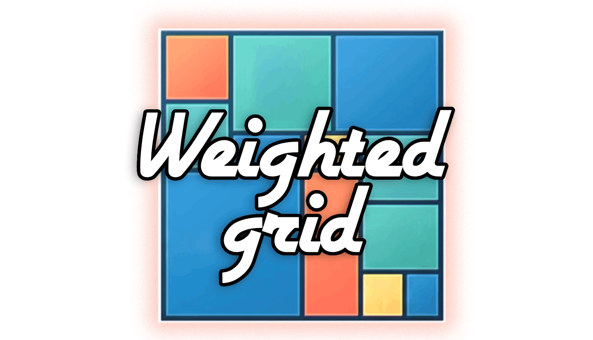

# weighted-grid

<!-- README_HEAD:START -->

[](https://www.npmjs.com/package/react-pack)
[](./LICENSE)
[](./tsconfig.json)
[](https://github.com/jayF0x/react-pack/actions/workflows/ci.yml)



> ⭐ **Star this [repository](https://github.com/jayF0x/react-pack) if you'd like to support its growth**

<!-- README_HEAD:END -->

A zero-dependency, weight-driven, content-agnostic React grid that fills its container. Drop in
arbitrary children, optionally tag a few with a `weight`, and the layout resolves itself — no
coordinates, no manual math.

**[▶ Live demo](https://jayf0x.github.io/weighted-grid/)**

## Features

- Placement by a **squarified treemap** — each item's area is proportional to its `weight`, on
  both axes, so aspect ratios stay near-square instead of collapsing into slivers
- One `fill` prop toggles "stretch to fill the container" vs. "fixed columns, flows downward"
- Full TypeScript types, ESM + CJS builds, zero runtime dependencies (`react` is an optional peer)

## Install

```bash
bun add weighted-grid
```
||
```bash
npm install weighted-grid
```

## Quick start

```tsx
import { GridPack, GridItem } from 'weighted-grid/react';

<GridPack cols={7} fill>
  <GridItem weight={4}>hero</GridItem>
  <GridItem>a</GridItem>
  <GridItem>b</GridItem>
  <GridItem>c</GridItem>
</GridPack>;
```

Or use the placement algorithm directly, framework-free:

```typescript
import { packGrid } from 'weighted-grid';

const placed = packGrid([
  { id: 'hero', weight: 4 },
  { id: 'a' },
  { id: 'b' },
]);
// → [{ id, x, y, w, h }, ...]  fractions of the unit square (0..1), tiling it exactly
```

## Development

```bash
bun install
bun run test          # bun test
bun run typecheck
bun run build         # vite → dist/ (ESM + CJS + .d.ts)
bun run format        # biome check --write
bun run demo:dev      # local demo site
```

## License

[MIT](./LICENSE) © [jayF0x](https://github.com/jayf0x)
